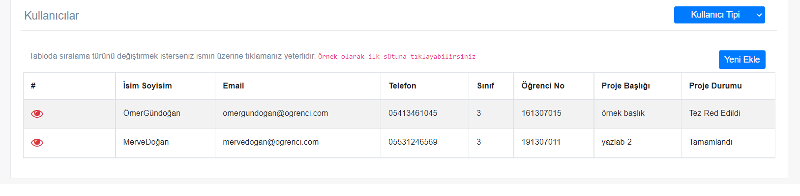

# KOÜ Proje Takip Sistemi - Project Tracking System - Made With Laravel

-This app made for a school project.
-Currently working on web try it!
http://odev-traking.herokuapp.com/

  

   
  

   
  

   
  

## What is the KOU Basvuru Sistemi? What can you do in it?

**KOU is the abbreviation of Kocaeli University. It's a University at Turkey, Kocaeli. The app is made for collecting the applications made by students in KOU.**

**You can:**
 - If you're a student at there, you can create a personal account for make a application.
 - You can upload the required files for certain application type (Transcript etc.)
 - You can track the application made by yourself.
 - If you're an admin (It can be a teacher, worker at the University etc.) You can filter and list the applications of all application types, track them and accept or reject the applications made by students.

## Platform Support

**Platforms supported:**
 - Works fine in Web (currently only local)

## The Database Platform

  - In the database part, we decided that it would be logical to use Firebase, as we wanted a cloud-based database and supported NoSQL structure
  - The application's database is in a Firebase server

